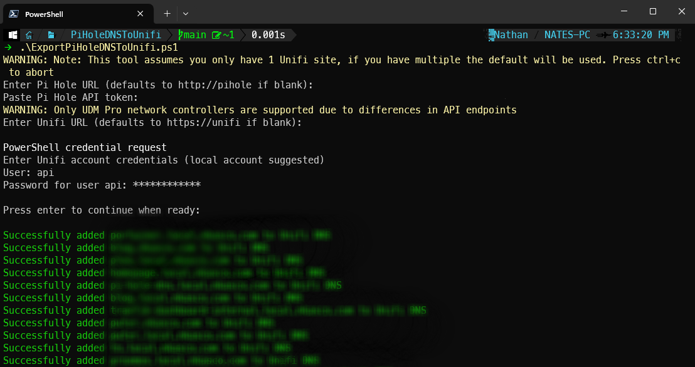

## Export Pi Hole DNS A Records to Unifi

### Instructions 
Pi Hole API token is available at: <piholeurl>/admin/settings.php?tab=api 
Unifi Admins & Users can be modified at: <unifiurl>/admin  
When creating a Unifi user for API use it is recommended to choose the following options: 
-Restrict to local access only 
-Username: api 
-Uncheck "Use a pre-defined role" 
-Network: Full Management 
-Protect: None 
-OS Setting: None

### Available Script Parameters: 
[switch]$EvaluationOnly - View potential changes without committing 
[switch]$TestOnly - Attempt to add 2 A Records (test and test2 with IPs of 192.168.99.998 and 192.168.99.999) 